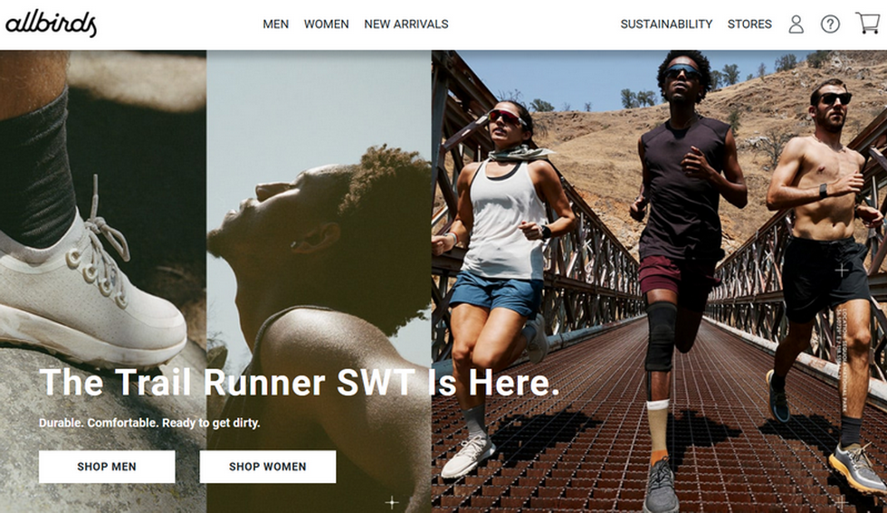

### Front-end Developer
# ***Tatsiana Holikava***

## Contacts

* __Phone:__ +375336847681
* __Email:__ holikavadev@gmail.com
* __GitHub:__ [holikava](https://github.com/holikava)
* __Telegram:__ tanyaholikava
* __Discord:__ holikava (@holikava)
* __Location:__ Gomel, Belarus

## About Me

> _see the goal - see no obstacles_

I decided to change my profession, as I received all the available experience in my current position. Now I can to plan my workflow, keep my concentration during work, even in stressful conditions, and I know how important to work in a team.

I chose programming, because there is no limit for learning. I want to realize my accumulated potential for education. And someday I`ll become an experienced front-end developer!

## Skills

* HTML5 & CSS3
* Git & GitHub
* SASS & BEM
* VS code & Figma
* JavaScript basics

## Code Example

``` 
let num1 = 8;
let num2 = 2;

function multiply() {
  let result = num1 * num2;
  sumEl.textContent = "Sum: " + result;
  console.log();
}
```

## Courses

* __freeCodeCamp__ Responsive Web Design _(done)_
* __freeCodeCamp__ JavaScript Algorithms and Data Structures _(in process)_
* __The Rolling Scopes school__ JavaScript/Front-end developer _(in process)_

## Experience



[Allbirds landing page](https://github.com/holikava/allbirds-running-shose.git) _(first responsive work)_

## Languages

* __English:__ upper intermediate (B2)
* __Russian:__ native speaker
